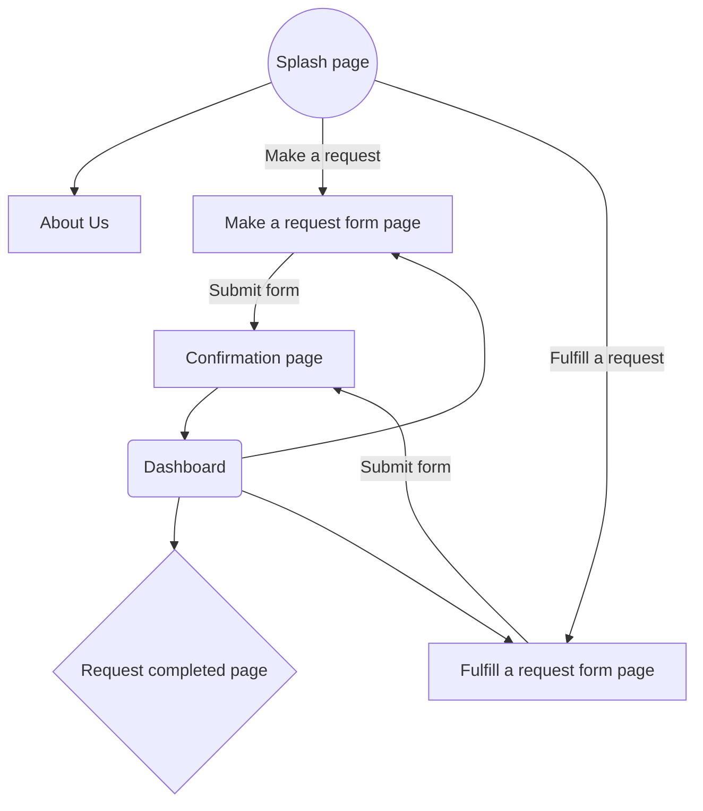

# PointSwap (BETA)

AKA: An unofficial SCU Dining Points exchange website.

## About the Project

Originally a [hackathon project](https://devpost.com/software/sweet-madame), **PointSwap** is a
simple website designed to help fellow SCU students purchase food/drink items for one another 
using any extra dining points they may have on hand.

The premise is simple: Everybody needs to eat. However, not every student at SCU can afford to. 
Conversely, lots of on-campus students often find they have more dining points than they know 
what to do with (on-campus students are forced to buy about $2000 worth of points every quarter, 
which then expire by the end of each school year).

With our website, both issues can now be solved!

## How to Use _PointSwap_

[IMG1: Home page] 
[IMG2: "Make a request" Flow Diagram] 
[IMG2: "Fulfill a request" Flow Diagram]

## Code Structure

### To Do

* A redirect to https://pointswap.glitch.me/auth/google
* Text box for Google Auth should check that the inputted email is "...@scu.edu"
